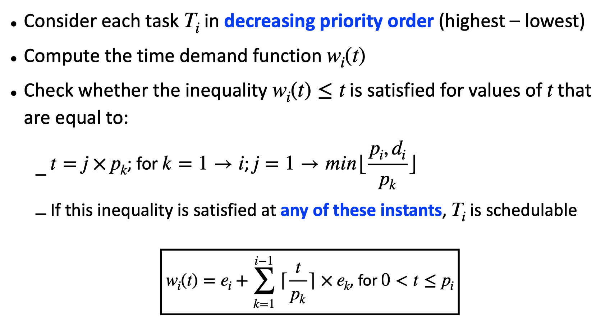
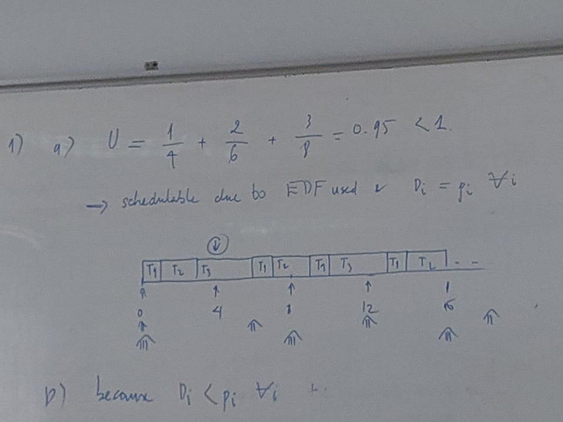

# `Chapter 4 - Review`
## `Schedulable utilization: EDF`

## `Check schedulability task: ` 
* U ≤ U_RM, when U_RM < U ≤ 1, consider simply periodic
* Simply periodic, if not consider time demand analysis
* Time demand:
  * Draw the time demand function graphs for all tasks or
  * Calculate time demand analysis
### `Details:`

## `Time demand analysis`

## `Exercises Chapter 4.1`

### `Solution`
#### 1. 
#### 2.
- a
- b
- J(3,1) bị trễ deadline 1 đơn vị thời gian => Điều chỉnh schedule bên trên sao cho J(3,1) được thực hiện trước 1 đơn vị thời gian => Giảm execution time của T1 hoặc T2. Đề bài yêu cầu điều chỉnh T1, and there exists 3 jobs from the task T1 and we need 1 unit of time available in the interval from 0 to 8 => The task T1 needs to be reduced at least 1/3 unit of execution time.
=> New execution time e1 = 2/3 = 0.667, delta_1 = 0.33
#### 3. 

## `Exercises Chapter 4.2`

### `Solution`
#### 1. 
##### a.

##### b.
* Because D_i < p_i for all i => Density test  
* Delta = 2/5 + 2/4 + 4/8 = 1.4 > 1 => might still be feasible (see schedulable utilization: EDF)  
* Run exhaustive simulation to prove

#### 2. 

## `Exercises Chapter 4.3`

### `Solution`
#### 1.  
a.  
b.  

#### 2. 
#### 3. 