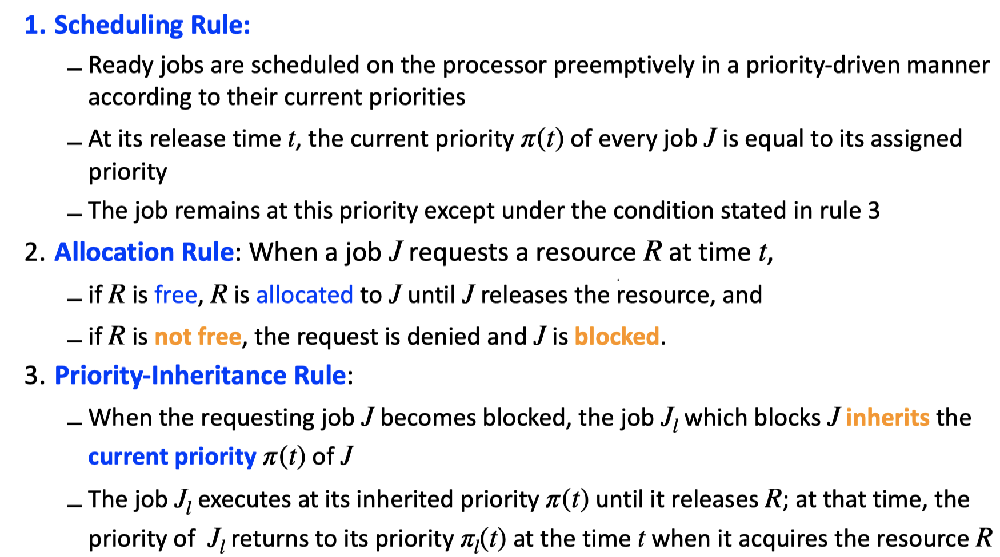

# Chapter 5: Resource access control protocols
In previous chapters, we ignores resources for scheduling processors. From this chapter, along with processors, additional **resources are required for jobs to be executed**.  
**Resources:** hardware devices, disk, memory, software resources (mutexes, locks, queues...)  
**Aims of this chapter:**
- How **resource contention** **affects** the **execution** behavior and **schedulability** of jobs 
- How **various resource access-control protocols** work to **reduce the undesirable effect** of resource contention 
- **How well these protocols succeed** in achieving this goal

## Definitions & Notations 
*Slide 4 - 14*
### Locks
### Critical sections
### Conflict & Blocking
### Resource access control
- Priority inversion
- Time anomalies
- Deadlock

### Resource access control protocols
- Non-preemptable Critical Sections - NPCS 
- Priority inheritance protocol
  - **The priority-ceiling protocol** extends the **priority-inheritance protocol** to **prevent deadlocks** and to **further reduce the blocking time**
- Basic priority ceiling protocol 
  - This has led to **two modifications** to the protocol:
    - The **stack-based priority ceiling protocol**
    - The **ceiling priority protocol**
- Stack-based priority ceiling protocol
- The ceiling priority protocol (in dynamic priority systems)

(Bên dưới chưa phân loại)
## Đề bài :

## Uncontrolled - Priority inversion

## Non-preemptive critical sections

## Basic priority inheritance protocol
### Rule

### Steps to schedule
- Schedule with algorithm
- Whenever resources needed, use the protocol to grant the resources: use rule 2
  - If there is any job blocked: use rule 3
- Whenever resource released, use rule 3 to return priorities

### Complex example
...
- t = 6:
  - J2 needs R2, but J5 holds R2. J2 is blocked by J5. Use rule 3, pi_5(6) = 2,  J5's priority now (t = 6) is J2's priority. J5 is executed with inherited priority (ignore blocked J2)
- t = 7: J5 continues to execute with its R2 resource.
- t = 8: J1 is released, it is highest priority. J1 is executed (J2 is stopped).   
...
- t = 11, J2 and J4 are both available, but we take J4 because at this time J4's priority is 1, J2 is 2.
- t = 12.5, J4 releases R2 resource, but J4 is not blocked with R2 resource => no return priority (still hold that priority).
- t = 13, ...