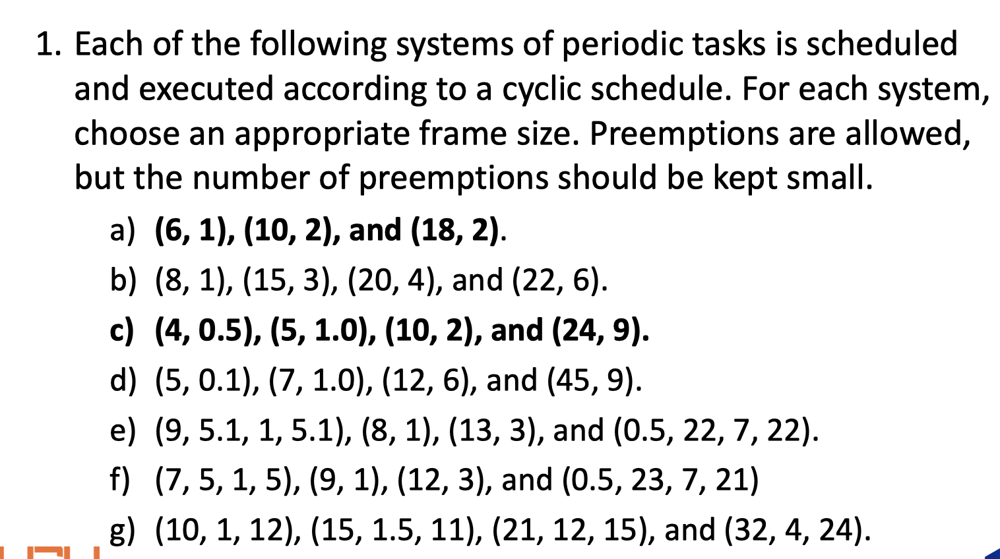

# Exercises

## Chapter 1

1. **Because sporadic jobs may have varying release times and execution times, the periodic task model may be too inaccurate and can lead to undue underutilization of the processor even when the inter release times of jobs are bounded from below and their executions are bounded from above. As an example, suppose we have a stream of sporadic jobs whose inter release times are uniformly distributed from 9 to 11. Their execution times are uniformly distributed from 1 to 3.**

   **a. What are the parameters of the periodic task if we were to use such a task to model the stream?**

   *For the peiodic task model we model a task using the lower bound on its period and the upper bound on its execution time (the worst case). In this case, the period, p = 9 and the execution time , e = 3.*

   **b. Compare the utilization of the periodic task in part (a) with the average utilization of the sporadic job stream.**

   

2. **Consider the real-time program described by the psuedo-code below. Names of jobs are in italic and green**:

   ```
   At 9AM, start: have breakfast 
   and 
   go to office; 
   At 10AM,
   	If there is class,
   		teach;
   		Else, help students; 
   When teach or help is done, eat lunch; 
   Until 2PM, sleep; 
   If there is a seminar,
   	If topic is interesting,
   		listen;
   		Else, read; 
   	Else write in office; 
   When seminar is over, attend 
   social hour; 
   discuss; 
   jog; 
   eat dinner; 
   work a little more; 
   end the day;
   ```

   *A. Draw a task graph to capture the dependencies among jobs.*

   

   *B. Use as many precedence graphs as needed to represent all the possible paths of the program*

   Vẽ hết tất cả các trường hợp của câu a.

## Chapter 2


### Solution

1. http://targetiesnow.blogspot.com/2013/10/real-time-system-by-jane-w-s-liu_9175.html

2. http://targetiesnow.blogspot.com/2013/10/real-time-system-by-jane-w-s-liu_1862.html

3. http://targetiesnow.blogspot.com/2013/10/real-time-system-by-jane-w-s-liu_6447.html

## Chapter 3




### Solution

1. 

   a,b. http://targetiesnow.blogspot.com/2013/10/real-time-system-by-jane-w-s-liu_5855.html 

   c,d. http://targetiesnow.blogspot.com/2013/10/real-time-system-by-jane-w-s-liu_3069.html

   e,f. http://targetiesnow.blogspot.com/2013/10/real-time-system-by-jane-w-s-liu_793.html

2. http://targetiesnow.blogspot.com/2013/10/real-time-system-by-jane-w-s-liu_2408.html

## Chapter 4.1


### Solution

1.

2.

3.

## Chapter 4.2


### Solution

1.

2.

## Chapter 4.3


Algorithm: https://en.wikipedia.org/wiki/Weighted_round_robin#Algorithm

Example: https://en.wikipedia.org/wiki/Weighted_round_robin#Example

[http://et.engr.iupui.edu/~dskim/Classes/ESW5004/RTSys%20Lecture%20Note%20-%20ch04%20Clock-Driven%20Scheduling.pdf](http://et.engr.iupui.edu/~dskim/Classes/ESW5004/RTSys Lecture Note - ch04 Clock-Driven Scheduling.pdf)