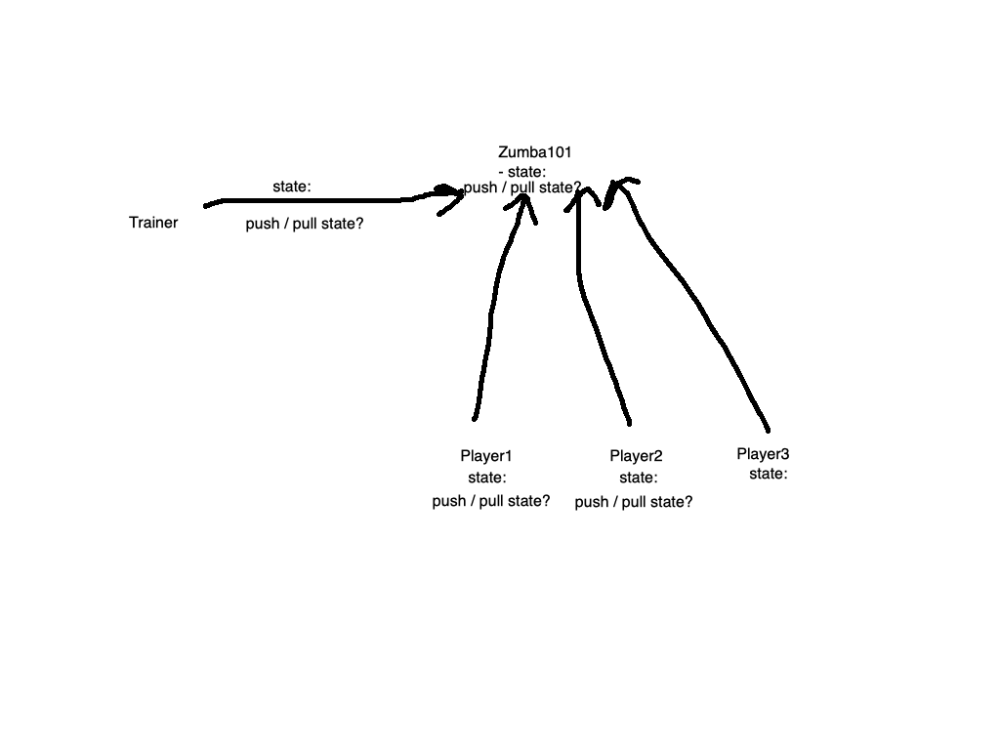

**Problem**: Trainer changes the state of Zumba class, player should receive the state by pulling the state.

- State: zumba class and the player of the class, the player want to know the state, he call the state.

